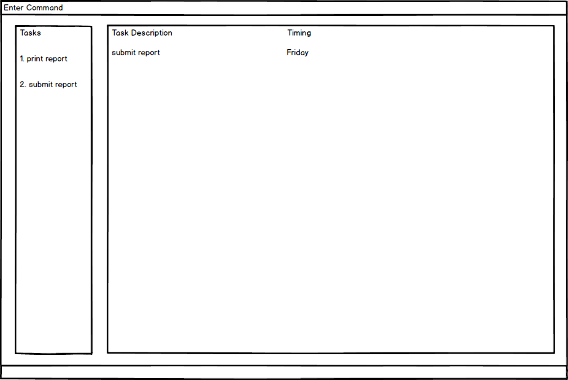

# Task Manager - User Guide

By : `Team SE-EDU`  &nbsp;&nbsp;&nbsp;&nbsp; Since: `Jun 2016`  &nbsp;&nbsp;&nbsp;&nbsp; Licence: `MIT`

---

1. [Quick Start](#quick-start)
2. [Features](#features)
3. [FAQ](#faq)
4. [Command Summary](#command-summary)

## 1. Quick Start

0. Ensure you have Java version `1.8.0_60` or later installed in your Computer. 

   > Having any Java 8 version is not enough.  
   > This app will not work with earlier versions of Java 8.

1. Download the latest `taskmanager.jar` from the [releases](../../../releases) tab.
2. Copy the file to the folder you want to use as the home folder for your Task manager.
3. Double-click the file to start the app. The GUI should appear in a few seconds.
   > 

4. Type the command in the command box and press <kbd>Enter</kbd> to execute it.  
   e.g. typing **`help`** and pressing <kbd>Enter</kbd> will open the help window.
5. Some example commands you can try:
   * **`help`** : list all the command can use
   * **`list`** : list all tasks
   * **`add submit report by Friday`** : add a task to the task manager
   * **`exit`** : exits the app
6. Refer to the [Features](#features) section below for details of each command. 

## 2. Features

### 2.1. Viewing help : `help`

Format: `help`

> Help is also shown if you enter an incorrect command e.g. `abcd`

A command guide will be shown in the window

### 2.2. Adding a task: `add`

Adds a task to the task manager 
Format: `add TITLE s/STARTDATE e/ENDDATE d/DESCRIPTION [#TAG]...`

> Tasks can have any number of tags (including 0)

Examples:

* `add Submit report e/01/01/2018 #academic`
* `add Read Harry Potter s/01/01/2017 e/01/01/2018 #personal`

### 2.3. Listing all tasks : `list`

Shows a list of all currently ongoing tasks in the task manager. 
Format: `list`
A list of tasks with index number will be shown in the column

### 2.4. Select a task : `select`

Selects the task identified by the index number used in the last task listing. 
Format: `select INDEX`

Examples:

* `list` 
  `select 2` 
  Selects the 2nd task in the task manager.
* `find report`  
  `select 1` 
  Selects the 1st task in the results of the `find` command.

### 2.5. Editing a task : `edit`

Edits an existing task in the task manager. 
The tasks can be edited through the index from a list. 
Format: `edit INDEX COMPONENT`

Examples:

* `edit 3 e/01/01/2018` 
  Changes the finishing time of task 3 to 01/01/2018
  
### 2.6. Mark a task as done when it finishes : `finish`

Mark a task as "done" when the task finishes in the task manager. 
The tasks can be edited through the index from a list and marked as done using a tag. 
Format: `finish INDEX [#done]`

Examples:

* `finish 4 #done` 

### 2.7. Finding all tasks containing any keyword in their task description: `find`

Format: `find KEYWORD`

Examples:

* `find report` 
  Returns `submit report`  `print report` etc. in the column

### 2.8. Deleting a task : `delete`

Deletes the specified task from the task manager. Irreversible. 
Format: `delete INDEX`

> Deletes the task at the specified `INDEX`.  
> The index refers to the index number shown in the most recent listing. 
> The index **must be a positive integer** 1, 2, 3, ...

### 2.9. Clearing all entries : `clear`

Clears all entries from the task manager. 
Format: `clear`

### 2.10. Viewing history of task : `history`

A list of history of tasks that have been completed will be shown in the column sorted in reverse-chronological order
Format: `history`

### 2.11. Exiting the program : `exit`

Exits the program. 
Format: `exit`

### 2.12. Saving the data

Task Manager data are saved in the hard disk automatically after any command that changes the data. 
There is no need to save manually.

## 3. FAQ

**Q**: How do I transfer my data to another Computer? 
**A**: Install the app in the other computer and overwrite the empty data file it creates with
       the file that contains the data of your previous Task Manager folder.

## 4. Command Summary

Command | Syntax | Example
------- | ------ | -------
Help    | help
Add     | add TITLE s/STARTDATE e/ENDDATE d/DESCRIPTION [#TAG]...| add Submit report e/01/01/2018
List    | list
Select  | select INDEX                    | select 3
Edit    | edit INDEX COMPONENT            | edit 3 e/Saturday
Finish  | finish INDEX [#done]            | finish 3 #done
Find    | find KEYWORD                    | find report
Delete  | delete INDEX                    | delete 3
Clear   | clear
History | history
Exit    | exit
 
